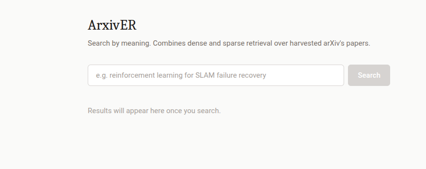
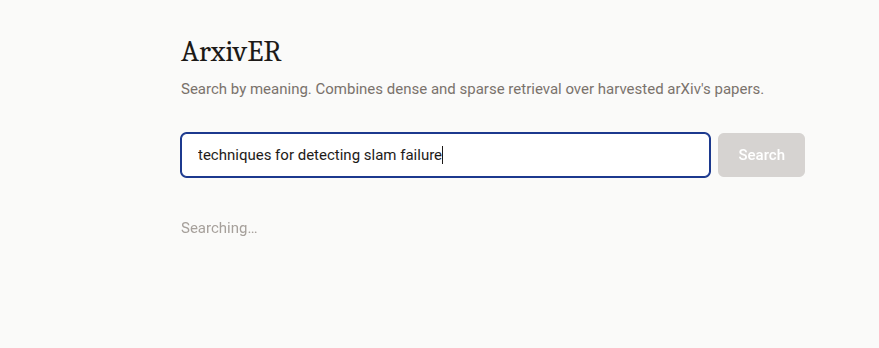
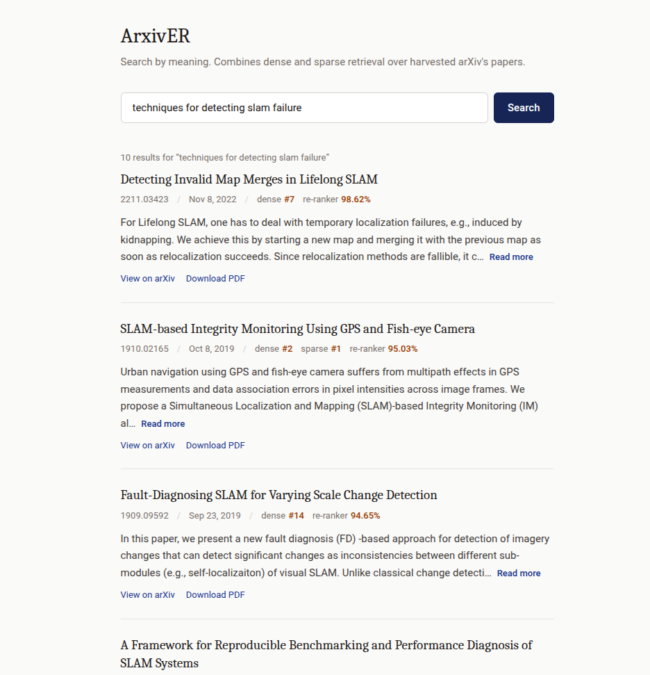

# arxiver

Arxiv search system

In this project, I have created a search system for arXiv papers. The system is based on a combination of sparse and dense retrieval methods, which are then fused using Reciprocal Rank Fusion (RRF) and re-ranked using a Cross Encoder.

It works by ingesting metadata from arXiv's OAI-PMH API, storing it in a PostgreSQL database, and creating embeddings for the titles and abstracts of the papers using Sentence Transformers. The embeddings are then stored in the database using pgvector, which allows for efficient similarity searches.

## RRF (Reciprocal Rank Fusion)

RRF is a method for combining the results of multiple retrieval systems into a single ranked list. In this project, I have used RRF to combine the results of a sparse retriever and a dense retriever.

### Sparse Retrieval

Utilizes PostgreSQL's Full Text Search (FTS) capabilities to perform keyword-based searches on the titles and abstracts of the papers. This method is fast and efficient, but it may not capture the semantic meaning of the query.

```sql
SELECT id, datestamp, title, abstract, ts_rank_cd(fts, websearch_to_tsquery('my natural language query')) AS rank
FROM {cfg.POSTGRES_ARXIV_TABLE}
WHERE fts @@ websearch_to_tsquery('my natural language query')
ORDER BY rank DESC
LIMIT 60;
```

The `fts` column is a tsvector that is created by concatenating the title and abstract of each paper. The following SQL command creates an index on the `fts` column to improve the performance of FTS queries. The GIN (Generalized Inverted Index) works by creating an inverted index of the terms in the `fts` column, allowing for fast lookups of documents that match a given query. An inverted index is a data structure that maps terms to the documents that contain them, making it efficient for searching large collections of text.

```sql
CREATE INDEX fts_idx ON arxiv_meta USING GIN (fts);
```

### Dense Retrieval

Dense retrieval is based on the semantic meaning of the query and the documents. It uses embeddings generated by a pre-trained language model to represent the titles and abstracts of the papers as fixed-size vectors. The embeddings are then stored in the database using pgvector, which allows for efficient similarity searches using cosine similarity.

```sql
SELECT id, datestamp, title, abstract
FROM {cfg.POSTGRES_ARXIV_TABLE}
ORDER BY embedding <=> '[4.3, 145.2, ...]'::vector
LIMIT 60;
```

The `embedding` column is a vector that is created by encoding the title and abstract of each paper using a pre-trained language model. The following SQL command creates an index on the `embedding` column to improve the performance of similarity searches. The HNSW (Hierarchical Navigable Small World) index works by creating a graph of the embeddings, allowing for fast lookups of the nearest neighbors of a given query embedding. The HNSW algorithm is based on the idea of creating a small-world network, where each node is connected to a small number of other nodes, allowing for efficient navigation through the graph.

```sql
CREATE INDEX embedding_idx ON arxiv_meta USING hnsw (embedding vector_l2_ops);
```

## Running the project

The project is separated into three main components: the ingestion process, the API, and the frontend. Each component can be run independently using Docker Compose.

As a prerequisite, you will need to create a `.env` file based on the `.env.example` file. You can just copy the `.env.example` file and rename it to `.env`.

### Ingestion

The ingestion of metadata from arXiv's OAI-PMH API is done using a batch processing approach. The ingestion process fetches records in batches, extracts the relevant metadata, generates embeddings for the titles and abstracts, and stores the data in the PostgreSQL database.

Let's visualize an example of the output. This corresponds to the ingestion of 1300 records with a batch size of 130. I have noticed that arXiv's OAI-PMH returns 1300 results per each paginated response, so a batch size of 130 results in 10 iterations of embeddings extraction and avoids OOM issues in an 8GB VRAM GPU. 

``` bash
docker compose run --rm ingestor_etl

2026-09-21 16:52:23,764 [INFO] src.etl.ingestor.fetcher: Fetching resumables...
2026-09-21 16:52:23,766 [INFO] src.etl.ingestor.fetcher: Fetched 2 ListSet resumables for sets: cs:cs:DC, cs:cs:RO
2026-09-21 16:52:23,768 [INFO] sentence_transformers.base.model: Loading SentenceTransformer model from sentence-transformers/all-mpnet-base-v2.
Loading weights: 100%|████████████████████████████████████████████████████████████████████████████████████████████████████████████████████████████| 199/199 [00:00<00:00, 23043.08it/s]
2026-09-21 16:52:24,146 [INFO] src.etl.ingestor.fetcher: Fetching for set 'cs:cs:RO'
resume_token=verb%3DListRecords%26metadataPrefix%3DarXiv%26from%3D2023-01-06%26set%3Dcs%253Acs%253ARO%26skip%3D6, token_expire_date=2026-09-22 00:00:00+00:00, now=2026-09-21 18:52:24.146688+02:00
2026-09-21 16:52:24,452 [INFO] src.etl.ingestor.fetcher: Found 1300 papers for set: cs:cs:RO
Batches: 100%|███████████████████████████████████████████████████████████████████████████████████████████████████████████████████████████████████████████| 1/1 [00:02<00:00,  2.41s/it]
Batches: 100%|███████████████████████████████████████████████████████████████████████████████████████████████████████████████████████████████████████████| 1/1 [00:02<00:00,  2.24s/it]
Batches: 100%|███████████████████████████████████████████████████████████████████████████████████████████████████████████████████████████████████████████| 1/1 [00:02<00:00,  2.24s/it]
Batches: 100%|███████████████████████████████████████████████████████████████████████████████████████████████████████████████████████████████████████████| 1/1 [00:02<00:00,  2.24s/it]
Batches: 100%|███████████████████████████████████████████████████████████████████████████████████████████████████████████████████████████████████████████| 1/1 [00:02<00:00,  2.24s/it]
Batches: 100%|███████████████████████████████████████████████████████████████████████████████████████████████████████████████████████████████████████████| 1/1 [00:02<00:00,  2.26s/it]
Batches: 100%|███████████████████████████████████████████████████████████████████████████████████████████████████████████████████████████████████████████| 1/1 [00:02<00:00,  2.24s/it]
Batches: 100%|███████████████████████████████████████████████████████████████████████████████████████████████████████████████████████████████████████████| 1/1 [00:02<00:00,  2.10s/it]
Batches: 100%|███████████████████████████████████████████████████████████████████████████████████████████████████████████████████████████████████████████| 1/1 [00:02<00:00,  2.25s/it]
Batches: 100%|███████████████████████████████████████████████████████████████████████████████████████████████████████████████████████████████████████████| 1/1 [00:02<00:00,  2.24s/it]
2026-09-21 16:52:50,384 [INFO] __main__: Total ingested count: 1300/1000
```

The ingestion process can be run using the following command. This will fetch the metadata from arXiv's OAI-PMH API, generate embeddings, and store the data in the PostgreSQL database. 

```bash
docker compose run --rm ingestor_etl
```

The ingestion process can be run multiple times to fetch new records. The docker compose service will run this command with the default parameters, but you can also run it with custom parameters. The following command will fetch 10000 records from the cs:cs:RO set (which corresponds to the Robotics category) and store them in the database. You can change the set and the number of records to fetch as needed:

```bash
python -m src.etl.ingestor.runner cs:cs:RO 10000
```

The ingestion process keeps track of the token provided by arXiv's OAI-PMH API and the last datestamp of the records ingested for each set. This allows the ingestion process to fetch only new records in subsequent runs, avoiding duplicates and ensuring that the database is up-to-date with the latest papers.

### API/Frontend

The project can be run using Docker Compose. The following command will start the API, PostgreSQL database, and the frontend (accessible via nginx at http://localhost:8080):

```bash
docker compose up
``` 

Once the ingestion process has been run and the database has been populated with data, you can access the frontend at http://localhost:8080. The frontend allows you to search for papers using natural language queries and view the results. Here is an example of the frontend interface:





This is an example of the search results page, which displays the papers that match the query. The results are ranked based on the relevance to the query, and you can click on each paper to view more details.




## Model Performance

The performance of the ingestion process is highly dependent on the hardware used.

This project does not aim to be a production-ready system, but rather a proof-of-concept for a search system for arXiv papers. The ingestion process can be run on a CPU or a GPU, but the performance will vary significantly depending on the hardware used. 

The following are some benchmarks for the ingestion process using different hardware configurations. For inference, with the model sentence-transformers/all-mpnet-base-v2 and a batch size of 130 (on an nvidia 5060 8GB VRAM):

### CPU
```bash
Batches: 100%|███████████████████████████████████████████████████████████████████████████████████████████████████████████████████████████████████████████| 1/1 [00:20<00:00, 20.88s/it]
```

### GPU
```bash
Batches: 100%|███████████████████████████████████████████████████████████████████████████████████████████████████████████████████████████████████████████| 1/1 [00:02<00:00,  2.41s/it]
```

GPU inference is significantly faster than CPU inference, and it is recommended to use a GPU for the ingestion process if available. The batch size can also be adjusted based on the available VRAM to avoid OOM issues.

### API

As per the API, the performance using the models in .env.example is the following. The recommended approach for a production system is to use a faster inference engine such as TEI, but for this projects purpose this is sufficient. The Cross Encoder re-ranking takes up most of the time from a request due to cross attention, specially if the limit of returned documents increases.

```bash
api-1      | 0.653 Runner.run  asyncio/runners.py:86
api-1      | ├─ 0.627 coro  starlette/middleware/base.py:139
api-1      | │     [11 frames hidden]  starlette, fastapi
api-1      | │        0.624 run_endpoint_function  fastapi/routing.py:344
api-1      | │        └─ 0.624 search_paper  src/api/main.py:83
api-1      | │           └─ 0.624 Retriever.search  src/api/retrieval.py:195
api-1      | │              ├─ 0.403 Reranker.rank  src/api/retrieval.py:103
api-1      | │              │  └─ 0.403 wrapper  sentence_transformers/util/decorators.py:34
api-1      | │              │        [51 frames hidden]  sentence_transformers, torch, transfo...
api-1      | │              │           0.331 linear  <built-in>
api-1      | │              └─ 0.221 BatchedEmbeddingGen.embed  src/api/retrieval.py:83
api-1      | │                 └─ 0.221 Queue.put  asyncio/queues.py:110
api-1      | │                    └─ 0.221 [await]  asyncio/queues.py
api-1      | └─ 0.024 [self]  asyncio/runners.py
```


